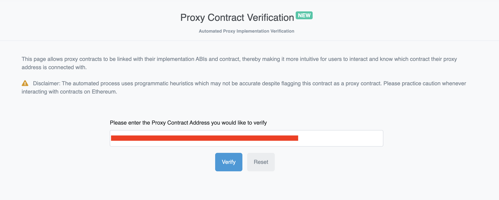

# 🪨 Rock Paper Scissors ✂️ Mint

A Dapp for minting Rock, Paper and Scissors NFTs.

The tokens are **ERC1155** compliant, off-chain data on a **decentralized storage** service layered with **IPFS**.

A user may mint multiple tokens at once. As long as there is a supply remaining, they can mint up to a pre-determined amount of tokens.

[Live demo](https://rock-paper-scissors-nft.surge.sh/)

- You will need Goerli ETH to purchase an NFT. I recommend [Alchemy's faucet](https://goerlifaucet.com/).

## Features

- Tokens are **burnable**, **mintable**, and **transferable**. With **Access Control**, these actions are **pausable**.

- With Access Control, the contract is **upgradeable**, and supports 3 phases (Whitelist, Public, Closed) with different pricing and mint and supply limits.

- A user can connect with 5 wallet providers: **MetaMask**, **Rainbow**, **Coinbase Wallet**, **WalletConnect**, and **Trust Wallet** and mint on mobile or desktop.

- A user receives a **notification** when the transaction goes through (or fails).

- When the user **connects**, they can access their profile to see their **recent transactions**, connected wallet address, and to manually **disconnect**.

- An **NFT Gallery** displays all minted NFTs using the Alchemy NFT API.

## Components

- <details><summary><b>🦾 Development Tools</b></summary>

  - **Yarn** - package manager
    - This project uses [Yarn Workspaces](https://yarnpkg.com/en/docs/workspaces/)
    - [Read more](https://github.com/sashadev-sky/Rock-Paper-Scissors-Mint/wiki/%F0%9F%A7%B6-Yarn-Configuration) about its configuration in the project Wiki
  - **Node.js**
  - **TypeScript**
  - **Git** - version control
  - **CRA** - create react app

</details>

- <details><summary><b>⛓️ Ethereum</b></summary>

  - **Solidity** (v.0.8.19) - implementing smart contracts
    - [Read more](https://github.com/sashadev-sky/Rock-Paper-Scissors-Mint/wiki/%F0%9F%93%83-Contract-Configuration) about the contract configuration
  - **HardHat** - Ethereum development environment
    - [Read more](https://github.com/sashadev-sky/Rock-Paper-Scissors-Mint/wiki/%F0%9F%91%B7-Hardhat-Configuration) about its configuration in the project Wiki
  - **ethers.js** (v.5) - library for interacting with the Ethereum blockhain
  - **OpenZeppelin** (v.4) - smart contract base implementation
  - **Etherscan** - contract verification
    - <https://etherscan.io/myapikey>

  Public network node providers

  - **Alchemy**
  - **Infura**

  Decentralized storage

  - **NFT.Storage**
  - **IPFS (InterPlanetary File System)**

</details>

- <details><summary><b>Frontend</b></summary>

  - **React** - JavaScript framework
    - **RainbowKit** - Ethereum wallet integration
    - **Wagmi** - Ethereum hooks
    - **Material UI** - UI framework
    - **React Router** - Client side routing

</details>

---

# 🏄‍♂️ Quick Start

Prerequisites: [Node](https://nodejs.org/en/download/) plus [Yarn](https://yarnpkg.com/getting-started/install).

## 👷 Hardhat

> The `rps-hardhat` workspace uses Hardhat as the platform layer to orchestrate all tasks related to smart contract development.

Create a `.env` file in the `hardhat` folder and add the values for the variables

  ```shell
  cp packages/hardhat/.env.example packages/hardhat/.env
  ```

### Smart Contract Development

After updating a contract, compile it and generate Typechain typings

- Hardhat always runs the `compile` task when running scripts with its command line interface, so this is not required unless you plan running them directly using `node`.

```shell
yarn compile
```

Then deploy it to Ethereum on the Goerli or Mainnet network

- The deployed address is the address of our deployed **proxy** instance

```shell
yarn deploy --network <network_name>
```

#### Interacting with a contract

Once deployed, you can interact with the **implementation** instance of the contract in Etherscan at `https://goerli.etherscan.io/address/<implementation-address>#code`.

You can also interact with it from the proxy contract at `https://goerli.etherscan.io/address/<proxy-address>#code` by verifying the proxy instance:

- Select the 'More Options' dropdown menu, select 'Is this a proxy?'. That will take you to the following page:

  |
  ---------|
  Fig.1 - Proxy Contract Verification page. The address in the red rectangle will be that of the **proxy**|

- Select 'Verify'. The address that pops up is the implementation contract's

- Now when you go back to Contract -> Code, you will see two new tabs `Read as Proxy` and `Write as Proxy`.

  |
  ---------|
    Fig.2 - Contract page. Read and write from our **implementation** contract|

## ⚛ React

> The `rps-frontend` workspace uses React as the framework to create the interface for our contract with "Ethereum components" (ConnectButton, WalletAddress, etc.) and read and write to it via hooks.

1. Install development dependencies to customize `react-scripts`

    ```shell
    yarn workspace rps-hardhat add -D env-cmd customize-cra react-app-rewired
    ```

2. Create a `.env` file in the `frontend` folder and add the values for the variables:

    ```shell
    cp packages/frontend/.env.example packages/frontend/.env
    ```

    - After deploying a new contract, you will need to update the `REACT_APP_TESTNET_PROXY_CONTRACT_ADDRESS` or `REACT_APP_MAINNET_PROXY_CONTRACT_ADDRESS` variable.

3. In `src/constants/index.ts` update the imported contract at the top to your contract's path, the variables under "SEO and Contract Related Info" to match your Application, and the `CHAIN_ID` variable under "Network Related Info" to match the default chain to use (1 (homestead) or 5 (goerli)).

4. Start up the development server with hot reloading

    ```shell
    yarn start
    ```

### Commands

#### Tasks

##### See a list of all tasks available

```shell
yarn hardhat
```

##### Compile contracts and generate Typechain typings

```shell
yarn compile
```

##### Deploy a contract to Ethereum

```shell
yarn deploy
yarn deploy:goerli
yarn deploy:mainnet
```

##### Print a list of accounts

```shell
yarn accounts -- <network>  # default network is 'hardhat'
```

##### Print an account balance

```shell
yarn balance -- <account_address>
yarn balance:goerli -- <account_address>
yarn balance:mainnet -- <account_address>
```

##### Print the current block number

```shell
yarn blockNumber -- <network>  # default network is 'hardhat'
```

##### Run the Solidity linter

```shell
yarn lint:hardhat
```

##### Run contract tests

```shell
yarn test:hardhat
```

##### Run the development server with hot reloading

```shell
yarn start
```

##### Create a production build of the site and deploy

```shell
yarn ship
```
