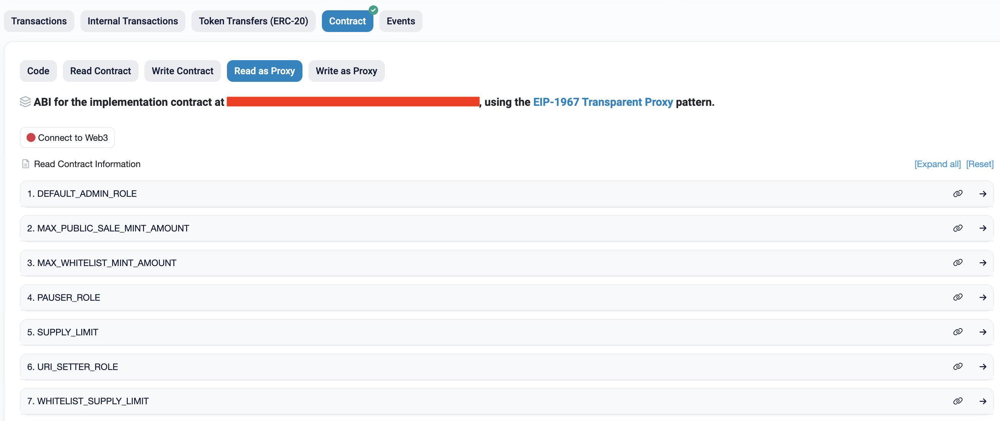

# 🪨 Rock Paper Scissors ✂️ Mint

A Dapp for minting Rock, Paper and Scissors NFTs.

The tokens are **ERC1155** compliant, off-chain data on a **decentralized storage** service layered with **IPFS**.

A user may mint multiple tokens at once. As long as there is a supply remaining, they can mint up to a pre-determined amount of tokens.

## Features

- Tokens are **burnable**, **mintable**, and **transferable**. With **Access Control**, these actions are **pausable**.

- With Access Control, the contract is **upgradeable**, and supports 3 phases (Whitelist, Public, Closed) with different pricing and mint and supply limits.

- A user can connect with 5 wallet providers: **MetaMask**, **Rainbow**, **Coinbase Wallet**, **WalletConnect**, and **Trust Wallet** and mint on mobile or desktop.

- A user receives a **notification** when the transaction goes through (or fails).

- When the user **connects**, they can access their profile to see their **recent transactions**, connected wallet address, and to manually **disconnect**.

## Components

<ol>
<details><summary><b>🦾 Development Tools</b></summary>

- **Yarn** - package manager
  - This project uses [Yarn Workspaces](https://yarnpkg.com/en/docs/workspaces/)
  - [Read more](https://github.com/sashadev-sky/Rock-Paper-Scissors-Mint/wiki/%F0%9F%A7%B6-Yarn-Configuration) about its configuration in the project Wiki
- **Node.js**
- **TypeScript**
- **Git** - version control
- **CRA** - create react app

</details>

<br>

<details><summary><b>Ethereum</b></summary>

- **Solidity** (v.0.8.10) - implementing smart contracts
- **[HardHat](https://hardhat.org/)** - Ethereum development environment
  - [Read more](https://github.com/sashadev-sky/Rock-Paper-Scissors-Mint/wiki/%F0%9F%91%B7-Hardhat-Configuration) about its configuration in the project Wiki
- **ethers.js** (v.5) - library for interacting with the Ethereum blockhain
- **OpenZeppelin** (v.4) - smart contract base implementation
- **Etherscan** - contract verification
  - <https://etherscan.io/myapikey>

Public network node providers

- **Alchemy**
- **Infura**

Decentralized storage

- **[NFT.Storage](https://nft.storage/)**
- **IPFS (InterPlanetary File System)**

</details>

<br>

<details><summary><b>Frontend</b></summary>

- **React** - JavaScript framework
  - **RainbowKit** - Ethereum wallet integration
  - **Wagmi** - Ethereum hooks
  - **Material UI** - UI framework
  - **React Router** - Client side routing

</details>

---

## 🏄‍♂️ Quick Start

Prerequisites: [Node](https://nodejs.org/en/download/) plus [Yarn](https://yarnpkg.com/getting-started/install).

## 👷 Hardhat

> The `rps-hardhat` workspace uses Hardhat as the platform layer to orchestrate all tasks related to smart contract development.

Create a `.env` file in the `hardhat` folder and add the following variables:

  ```dotfile
  ALCHEMY_STAGING_KEY=
  ALCHEMY_PRODUCTION_KEY=
  MNEMONIC=
  ```

## Writing smart contracts

See [How to Create and Deploy an ERC1155 NFT](./docs/how_to_create_an_ERC1155_nft.md).

## Adding a new contract

1. OpenZeppelin

    ```bash
    yarn workspace rps-hardhat add -D @openzeppelin/contracts-upgradeable
    ```

2. Create a `src` directory and add your `.sol` contract to it

3. Compile

    ```bash
    yarn compile
    ```

## Deployment Scripts

1. Create a new directory called `deploy` and in that directory create a new file called `001_deploy_rps.ts`.

    ```typescript
    import { HardhatRuntimeEnvironment } from 'hardhat/types';
    import { DeployFunction } from 'hardhat-deploy/types';

    const func: DeployFunction = async function (hre: HardhatRuntimeEnvironment) {
      const {
        deployments,
        ethers,
        getNamedAccounts,
        upgrades
      } = hre;
      const { getNetworkName } = deployments;
      const { deployProxy, erc1967 } = upgrades;

      const targetNetwork = await getNetworkName();
      const { deployer } = await getNamedAccounts();

       // ############## DEPLOYING ###############

      const RPS = await ethers.getContractFactory('RPS');
      console.log(`Deployer ${deployer} is deploying RPS to the ${targetNetwork} network...`);
      // `hre.upgrades.deployProxy` will deploy the new implementation contract (unless there is one already from a previous deployment)
      const proxy = await deployProxy(RPS, [], {
        initializer: 'initialize',
        kind: 'transparent',
      });
      await proxy.deployed();
      console.log('RPS deployed to: ', proxy.address);

      const implementationAddr = await erc1967.getImplementationAddress(
        proxy.address
      );
    };

    export default func;

    func.tags = ['RPS'];
    ```

2. This account needs to be setup in `hardhat.config.ts`. Modify it so it looks like this:

    ```typescript
    namedAccounts: {
      deployer: 0,  // by default take the first account as deployer
    },
    ```

## Etherscan Verification

1. Add Etherscan verification to verify with etherscan if not deployed locally:

    ```bash
    yarn workspace rps-hardhat add -D @nomiclabs/hardhat-etherscan
    ```

2. Add the following variables to `.env`:

    ```dotfile
    ETHERSCAN_STAGING_KEY=
    ETHERSCAN_PRODUCTION_KEY=
    ```

3. Update the `hardhat.config.ts`

    ```typescript
    // import ...
    import '@nomiclabs/hardhat-etherscan';
    // import ...

    const config: HardhatUserConfig = {
      //...
      etherscan: {
        // provided by the @nomiclabs/hardhat-etherscan plugin
        apiKey: {
          rinkeby: process.env.ETHERSCAN_STAGING_KEY,
          mainnet: process.env.ETHERSCAN_PRODUCTION_KEY,
        },
      },
      //...
    };
    ```

4. Thanks to the `@nomiclabs/hardhat-etherscan` package, we can verify by running the`verify` task, passing the address of the contract and the constructor arguments that were used to deploy it (if any)

    ```js
    //...
    const {
      deployments,
      ethers,
      getNamedAccounts,
      run,
      upgrades,
    } = hre;

    //...
    // ############## VERIFACTION ###############

    // need to wait
    console.log('Waiting 60s to verify');

    /**
     * verification throws an error when the contract has already been verified
     * to make life easier, just catch this error and log it.
     * */
    await new Promise<void>((resolve) => {
      setTimeout(async () => {
        await run('verify:verify', {
          address: implementationAddr,
        }).catch((e) => console.error(`ERROR: ${e}`));
        resolve();
      }, 60* 1000);
    });
    //...
    ```

    <small>Notice that our verification is pointing to the <b>implementation</b>, not <b>proxy</b> address.</small>
    <br>

5. Run the deploy task

    ```bash
    yarn deploy
    ```

    <small>The deployed address is the address of our deployed **proxy** instance</small>
    <br>

6. Verify the Proxy

    - In Etherscan, find your contract by the deployed **proxy** address
    - Go to Contract > Code and in the right-side, select the 'More Options' dropdown menu, select 'Is this a proxy?'. That will take you to the following page:

    

    <small>The address in the red rectangle will still be that of the <b>proxy</b>.</small>

    <br>

    - Select 'Verify'. The address that pops up is the implementation contract's

    - Now when you go back to Contract > Code, you will see two new tabs `Read as Proxy` and `Write as Proxy`. This will allow us to read and write from and to our **implementation** contract:

    

## Commands

### Tasks

To see a list of all tasks available:

```bash
yarn hardhat
```

### Linting

To run the Solidity linter:

```bash
yarn lint:hardhat
```

### Compile contracts and generate Typechain typings

```bash
yarn compile
```

### Run contract tests

```bash
yarn test:hardhat
```

### Deploy to Ethereum

```bash
yarn deploy --network <network_name>
```

## Frontend

> The `rps-frontend` workspace uses React as the framework to create the interface for our contract with "Ethereum components" (ConnectButton, WalletAddress, etc.) and read and write to it via hooks.

1. Install development dependencies to customize `react-scripts`

    ```bash
    yarn workspace rps-hardhat add -D env-cmd customize-cra react-app-rewired
    ```

2. Create a `.env` file in the `frontend` folder and add the following variables:

    ```dotfile
    REACT_APP_ALCHEMY_STAGING_KEY=
    REACT_APP_ALCHEMY_PRODUCTION_KEY=
    REACT_APP_INFURA_ID=
    REACT_APP_RINKEBY_PROXY_CONTRACT_ADDRESS=
    REACT_APP_HOMESTEAD_PROXY_CONTRACT_ADDRESS=
    GENERATE_SOURCEMAP=false
    ```

    - After deploying a new contract, you will need to update the `REACT_APP_RINKEBY_PROXY_CONTRACT_ADDRESS` or `REACT_APP_HOMESTEAD_PROXY_CONTRACT_ADDRESS` variables.

3. In `src/constants/index.ts` update the imported contract at the top to your contract's path, the variables under "SEO and Contract Related Info" to match your Application, and the `CHAIN_ID` variable under "Network Related Info" to match the default chain to use (1 (homestead) or 4 (rinkeby)).

4. Start up the development server with hot reloading

    ```bash
    yarn start
    ```
