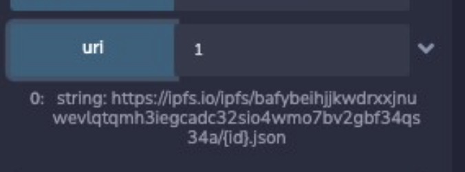
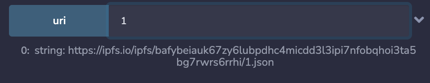

# How to Create and Deploy an ERC1155 NFT

1. Head over to the OpenZeppelin contract wizard and fill out the generator for ERC1155. (See **Configuration** in [OpenZeppelin `ERC1155` Notes](./oz_erc1155.md))

## Compatibility with OpenSea

Open the contract in Remix to interact with it.

When hitting `uri` you will get a uri in the same format as the output shown below:

</img>

---

**OpenSea does not support the returned URI format. So we will need to overwrite the `uri` function to return the file name as a string**

---

1. Import an OpenZeppelin contract to convert Integer to String.

2. Override the URI function by creating a custom URI function and converting token from integer to string, then returning the complete URI.
<br>

    ```go
    // contracts/RPS.sol

    import "@openzeppelin/contracts-upgradeable/utils/StringsUpgradeable.sol";
    //...
    function uri(uint256 _tokenid) override public pure returns (string memory) {
        return string(
            abi.encodePacked(
                "https://ipfs.io/ipfs/bafybeicxlrrqm5l6uqtngfmdgrzzqrklu2vdqwg3dx32fcqpffh7qyryju/",
                StringsUpgradeable.toString(_tokenid),".json"
            )
        );
    }
    ```

3. Compile and Deploy

4. Hit `uri` again and see the difference:


